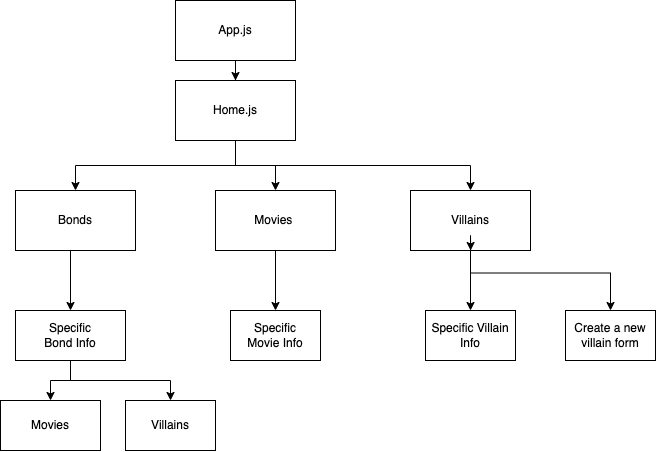
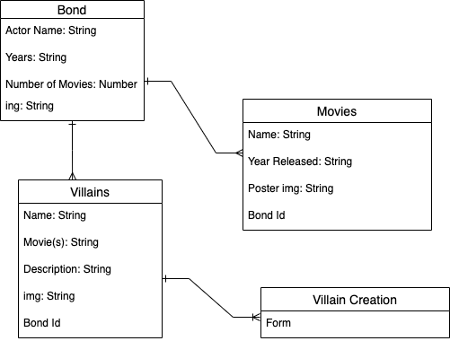

# Bond-James-Bond

## Date: 7/24/2022

### By: Jeff Fraley

#### [GitHub](https://github.com/frank-booth) | [LinkedIn](https://www.linkedin.com/in/jeff-fraley)

---

### **_Description_**

#### I am creating a site where Bond enthusiasts and novices can learn about all things Bond. The user will be able to navigate all six bonds, their movies and the villians they faced. In addition, users can create a new villain for Bond to face. Muhahaha!

---

### **_Technologies Used_**

- HTML
- CSS
- Javascript
- React
- Mongoose
- Express
- MongoDB

---

### **_Getting Started_**

##### Below are the Component Heirarchy and ERD:

##### A Trello board was used to keep track of development progress and can be viewed here: [Trello](https://trello.com/b/etdhFArk/bond-project-2).

---

### **_Credits_**
